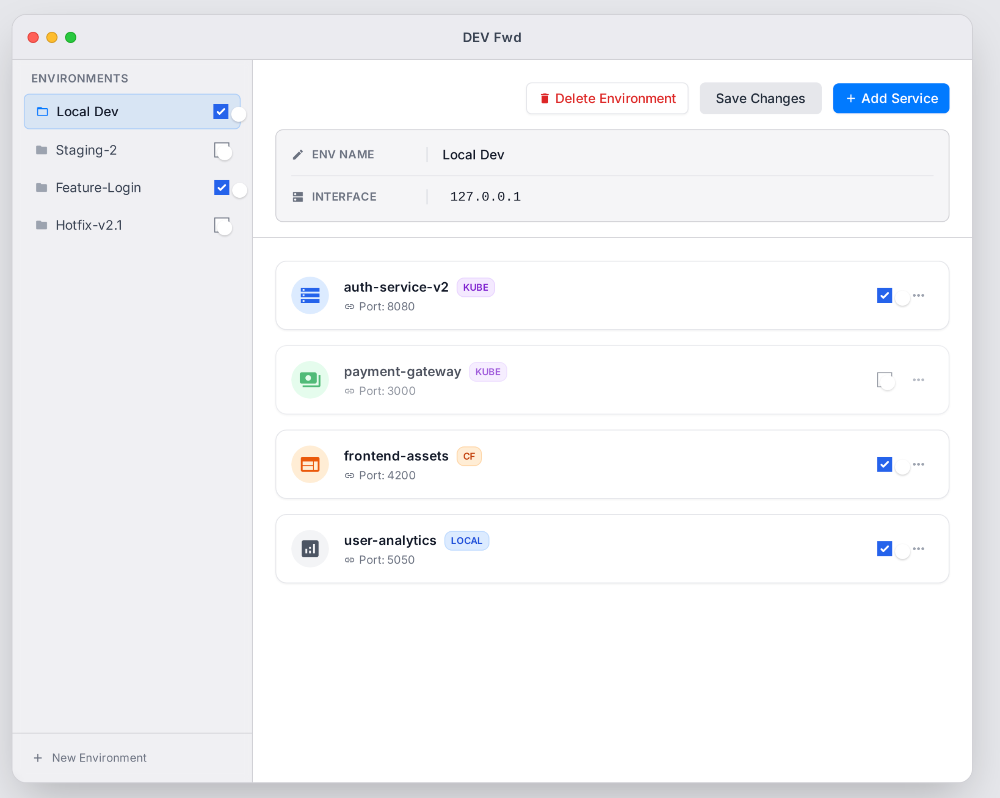
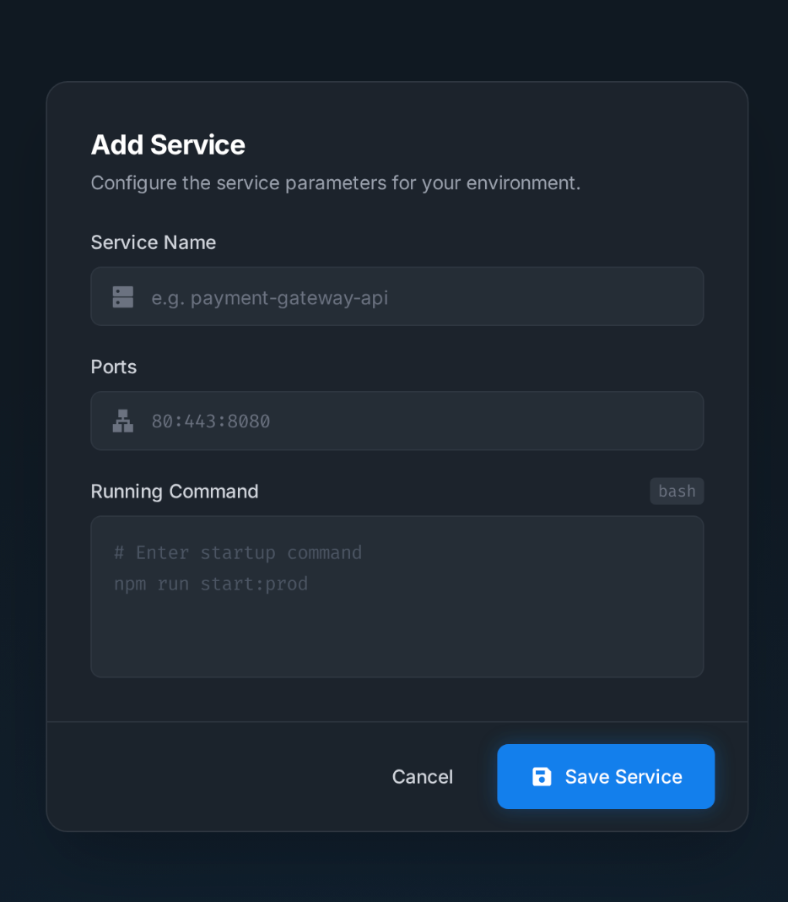
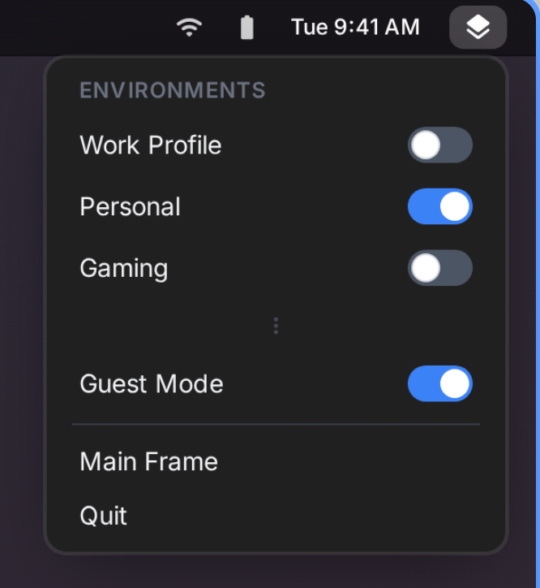

# Orbit

A macOS application for managing development environment port forwarding with loopback interface aliases.



## Overview

Orbit simplifies local development by allowing you to run multiple services on the same ports using different loopback IP addresses (127.0.x.x). This is particularly useful when:

- Running multiple microservices locally that all want port 8080
- Port-forwarding Kubernetes services to predictable local addresses
- Setting up SSH tunnels to remote databases
- Testing with Docker containers bound to specific IPs

## Features

- **Multiple Environments**: Create separate environments for different projects or contexts
- **Interface Aliases**: Automatically manage loopback interface aliases (127.0.x.x)
- **Variable Substitution**: Use `$IP`, `$IP2`, `$IP3` in commands that resolve to your configured interfaces
- **Service Management**: Start/stop services with automatic process lifecycle management
- **Menubar Integration**: Quick access to toggle environments without opening the main window
- **Real-time Logs**: View service output in dedicated log windows
- **Privileged Helper**: One-time admin authentication for passwordless network configuration

## Screenshots

<details>
<summary>Add Service</summary>



</details>

<details>
<summary>Menubar Menu</summary>



</details>

## Requirements

- macOS 13.0 (Ventura) or later
- Xcode 15+ (for building from source)
- [XcodeGen](https://github.com/yonaskolb/XcodeGen) (for project generation)

## Installation

### From Source

```bash
# Clone the repository
git clone https://github.com/SimonRen/orbit.git
cd orbit

# Install XcodeGen if needed
brew install xcodegen

# Generate Xcode project
xcodegen generate

# Build
xcodebuild -project orbit.xcodeproj -scheme orbit -configuration Release build

# The built app is at:
# ~/Library/Developer/Xcode/DerivedData/orbit-*/Build/Products/Release/Orbit.app
```

## Usage

### Creating an Environment

1. Click **"+ New Environment"** in the sidebar
2. Edit the environment name by clicking the pencil icon
3. Configure interface IPs (default: 127.0.0.2)
4. Add services with their startup commands

### Adding a Service

1. Click **"+ Add Service"**
2. Enter service name and ports (for display)
3. Write the command using variables:
   - `$IP` → first interface (e.g., 127.0.0.2)
   - `$IP2` → second interface
   - `$IP3` → third interface, etc.

### Example Commands

**Kubernetes port-forward:**
```bash
kubectl port-forward --address $IP svc/auth-service 8080:8080
```

**SSH tunnel:**
```bash
ssh -N -L $IP:5432:database.internal:5432 user@bastion.example.com
```

**Docker with specific IP:**
```bash
docker run -p $IP:3000:3000 my-service:latest
```

### Activating an Environment

Toggle the switch next to an environment in the sidebar or menubar. On first activation, you'll be prompted to install the privileged helper (one-time admin authentication).

## Configuration

Configuration is stored at:
```
~/Library/Application Support/Orbit/config.json
```

Runtime state (enabled status, service status, logs) is not persisted between app launches.

## Architecture

- **SwiftUI** for the user interface
- **XPC Service** for privileged network operations (interface alias management)
- **SMJobBless** for helper installation with code signing
- Built with **XcodeGen** for reproducible project configuration

## Development

```bash
# Generate project after file changes
xcodegen generate

# Build debug
xcodebuild -project orbit.xcodeproj -scheme orbit -configuration Debug build

# Run tests
xcodebuild -project orbit.xcodeproj -scheme orbit test

# Relaunch after build
pkill -f "Orbit.app"; open ~/Library/Developer/Xcode/DerivedData/orbit-*/Build/Products/Debug/Orbit.app
```

## Release Process

### Building a Release

```bash
# 1. Ensure clean working directory
git status

# 2. Build release configuration
xcodebuild -project orbit.xcodeproj -scheme orbit -configuration Release clean build

# 3. The release app is at:
ls ~/Library/Developer/Xcode/DerivedData/orbit-*/Build/Products/Release/Orbit.app

# 4. (Optional) Copy to Desktop for distribution
cp -R ~/Library/Developer/Xcode/DerivedData/orbit-*/Build/Products/Release/Orbit.app ~/Desktop/
```

### Tagging a Release

```bash
# Create annotated tag
git tag -a v0.x.x -m "Release v0.x.x - Description"

# Push tag to remote
git push origin v0.x.x
```

### Version History

| Version | Date | Highlights |
|---------|------|------------|
| v0.2.3 | 2025-12-25 | Icon fixes, performance improvements |
| v0.2 | 2025-12-25 | Import/export, UI improvements, robustness fixes |
| v0.1 | 2025-12-24 | Initial release |

## Import/Export

Environments can be exported to `.orbit.json` files and shared with team members.

**Export:** Right-click an environment → Export

**Import:** Click "Import..." button or use File → Import (⌘I)

See [docs/export-format.md](docs/export-format.md) for file format specification.

## License

MIT License - See LICENSE file for details.
